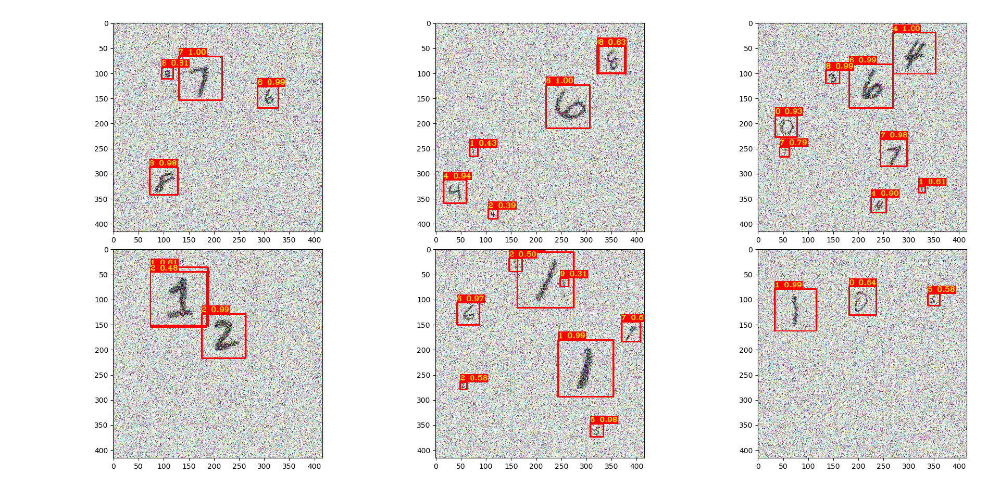
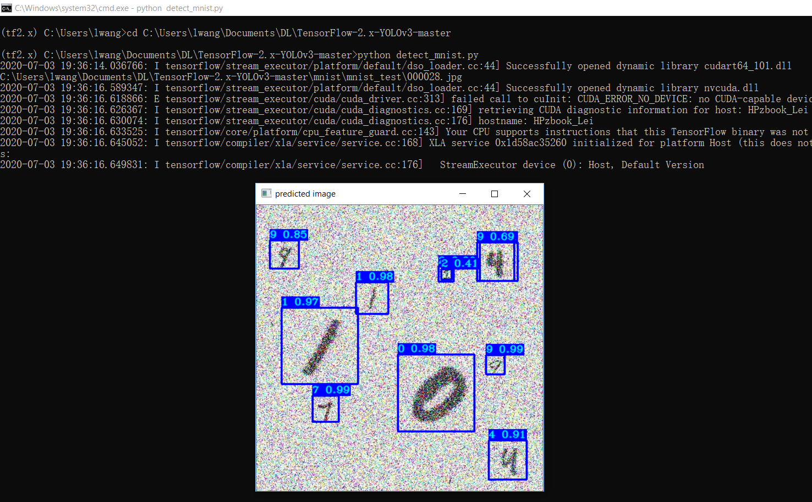

# Yolo v3 Tiny (TensorFlow 2.x) for noisy mnist detection

It turns out the trained NN from clearn background basically does not work on noisy testset (even with only a little noise, e.g., mean = variance = 0.1).
In this project, a Yolo-v3-tiny model was re-trained (from mnist dataset in Gaussian additive noise) to detect ramdom digits appearing in noisy backgrounds.

## Installation
First, clode or download this GitHub repository.
For Windows, put wget.exe under the project folder.

Install requirements and download pretrained weights, CMD open console:
```
pip install -r ./requirements.txt

# yolov3 (not needed here)
wget -P model_data https://pjreddie.com/media/files/yolov3.weights

# yolov3-tiny
wget -P model_data https://pjreddie.com/media/files/yolov3-tiny.weights
```

## Quick demo
Start with using pretrained weights to test predictions on both image and video:
```
python show_detect_performance.py
```

<p align="center">
    </a>
</p>

## Prepare a noisy mnist dataset
mnist folder contains mnist images, create training data:
```
python mnist/make_data.py
python mnist/add_noise2images.py
```
You can change training hyperparameters here `./yolov3/configs.py`.

## Custom training of Yolo v3 object detection 
I highly recommend to train the following step on Google Colab (see the last section below).

I could use my laptop to fry eggs after 100 epochs training (~3 hours) with a GPU Quadro M1200 (computing power of 5).
```
python train.py
```

Test detection with `detect_mnist.py` script:
```
python detect_mnist.py
```
Results:
<p align="center">
    </a>
</p>


## Google Colab Custom Yolo v3 training
To learn more about Google Colab Free gpu (Tesla T4 with the computing power 7!) training, visit this [tutorial](https://pylessons.com/YOLOv3-TF2-GoogleColab/)
and demo [notebook](./YOLOv3_colab_training.ipynb) (for using Colab) in this project.
