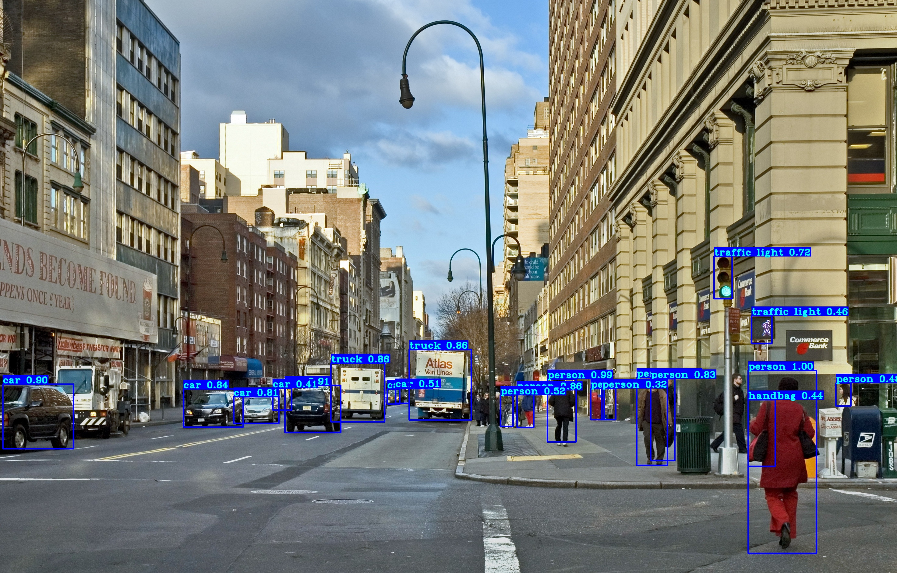
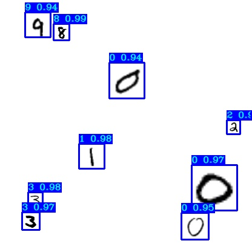

# Yolo v3 Tiny for noisy mnist detection

YOLOv3 implementation in TensorFlow 2.x, for transfer training.

A tiny YOLO model was re-trained for detect mnist dataset in Gaussian additive noise.

## Installation
First, clode or download this GitHub repository.
For Windows, put wget.exe under the project folder.

Install requirements and download pretrained weights:
```
pip install -r ./requirements.txt

# yolov3 (not needed here)
wget -P model_data https://pjreddie.com/media/files/yolov3.weights

# yolov3-tiny
wget -P model_data https://pjreddie.com/media/files/yolov3-tiny.weights
```

## Quick start
Start with using pretrained weights to test predictions on both image and video:
```
python detection_demo.py
```

<p align="center">
    </a>
</p>

## Quick training for custom mnist dataset
mnist folder contains mnist images, create training data:
```
python mnist/make_data.py
python mnist/add_noise2images.py
```
`./yolov3/configs.py` file is already configured for mnist training.

## Custom Yolo v3 object detection training
I highly recommend that to train the following step on Google Colab (see the last section below).
I did use my laptop with a GPU Quadro M1200 (computing power of 5), and it could fry eggs after 100 epochs training (~2 hours).
```
python train.py
tensorboard --logdir=log
```

Test detection with `detect_mnist.py` script:
```
python detect_mnist.py
```
Results:
<p align="center">
    </a>
</p>


## Google Colab Custom Yolo v3 training
To learn more about Google Colab Free gpu training, visit my [text version tutorial](https://pylessons.com/YOLOv3-TF2-GoogleColab/)
